# Ticketing System Security Report

> **Overview**

> This report covers:

> 1. Architecture Diagram
> 2. Risk Table
> 3. Mitigation Plan
> 4. Automated Security Pipelines

* [SecVectors](https://github.com/tree-1917/SecVectors)

---

## 1. Architecture Diagram

This system consists of **three main services**:

1. **Ticket Collector Service** – A webhook service that merchants call when a customer creates a ticket. Tickets and attachments are stored in **Redis** and **S3**.
2. **Ticket Processor (Golang Service)** – Polls Redis for tickets, uses tenant ID to identify the agent, processes sentiment using an external LLM, and stores results in **PostgreSQL**.
3. **Dashboard Service (Node.js)** – Displays tickets in real-time via WebSocket. Only accesses PostgreSQL for reading tickets and S3 for attachments.

**Deployment Architecture:**

* Hosted on **AWS Cloud**, using **ECS** with Docker containers.
* **Public subnets:** Ticket Collector, Dashboard, NAT Gateway.
* **Private subnet:** Golang Processor, Redis, PostgreSQL, S3.
* **Route53** used for internal DNS between public and private subnets.
* **CloudFront** in front of public services for caching, WAF, and external access.
* **NAT Gateway** allows Golang service to call external LLM APIs without exposing it to the internet.

```mermaid
graph TD
    subgraph AWS_Cloud["AWS Cloud"]

        %% Public Subnets
        subgraph Public_TC["Public Subnet - Ticket Collector"]
            TC[Ticket Collector Service]
        end
        subgraph Public_DB["Public Subnet - Dashboard"]
            DB_Dash[Dashboard Service]
        end
        subgraph Public_NAT["Public Subnet - NAT"]
            NAT[NAT Gateway]
        end

        %% Private Subnet
        subgraph Private_Subnet["Private Subnet"]
            Golang[Ticket Processor]
            Redis[Redis Cache]
            Postgres[PostgreSQL DB]
            S3[S3 Bucket - Attachments]
        end

        %% DNS + CloudFront
        Route53[Route53 Internal DNS]
        CloudFront[CloudFront Distribution]

    end

    Internet[Internet]

    %% Internet → CloudFront → Public Services
    Internet --> CloudFront
    CloudFront --> TC
    CloudFront --> DB_Dash

    %% Ticket Collector → Private Subnet
    TC -->|Store tickets| Route53
    TC -->|Store attachments| Route53
    Route53 -->|Tickets| Redis
    Route53 -->|Attachments| S3

    %% Dashboard → Private Subnet
    DB_Dash -->|Read tickets| Route53
    DB_Dash -->|Read attachments| Route53
    Route53 -->|Tickets| Postgres
    Route53 -->|Attachments| S3

    %% Golang Processor
    Golang -->|Fetch tickets| Redis
    Golang -->|Store sentiment + ticket| Postgres
    Golang -->|Call external LLM| NAT
    NAT -->|Forward request| Internet

    %% Styles
    style AWS_Cloud fill:#000
    style Public_TC fill:#111
    style Public_DB fill:#111
    style Public_NAT fill:#222
    style Private_Subnet fill:#333
    style Internet fill:#333
    style Route53 fill:#444
    style CloudFront fill:#555,stroke:#ff33cc,stroke-width:2px

    %% Arch Notes %% 
    %% Route53 Will Have 2 profile 
    %% Profile A Make Ticket System Collector See Redis and S3 
    %% Profile B Make A DashBoard See Postgres 
    %% Ticket Process **Mind Of System** No Service Can Direct Access To It 
```



---

## 2. Risk Table

### Threat Vectors

| Vector | Count |
| ------ | ----- |
| Infra  | 7     |
| Web    | 10    |
| User   | 5     |
| LLM    | 5     |

---

### Infra Vectors

| ID | Risk                            | Severity | Impact                               |
| -- | ------------------------------- | -------- | ------------------------------------ |
| 1  | Secrets in env/container image  | Critical | Hardcoded AWS keys or DB credentials |
| 2  | No Backup Strategy              | Critical | Data loss                            |
| 3  | Misconfigured S3 bucket         | High     | Public exposure of attachments       |
| 4  | Insecure IAM roles              | High     | Excess privileges allow DB/S3 access |
| 5  | Inadequate logging & monitoring | Medium   | Delayed breach detection             |
| 6  | Weak encryption for JWT         | Medium   | Token forgery or data compromise     |
| 7  | No disaster recovery            | Medium   | Long downtime                        |

---

### Web Vectors

| ID | Risk                        | Severity | Impact                                    |
| -- | --------------------------- | -------- | ----------------------------------------- |
| 1  | XSS via web form            | Critical | Scripts run in dashboard                  |
| 2  | SQL Injection in API        | Critical | Data exfiltration / privilege escalation  |
| 3  | IDOR in multi-tenant system | Critical | Competitors access customer tickets       |
| 4  | Insecure cookies            | High     | JS can access sensitive cookies           |
| 5  | CSRF on ticket submission   | Medium   | Unauthorized ticket creation/modification |
| 6  | Insufficient rate limiting  | Medium   | LLM abuse / DoS dashboard                 |
| 7  | WebSockets abuse            | Medium   | Flooding updates, potential DoS           |
| 8  | Credential disclosure       | Medium   | Return plaintext passwords                |
| 9  | Lack of input validation    | Medium   | Injection or malformed data               |
| 10 | JWT replay attack           | Medium   | Reuse of tokens to access dashboard       |

---

### User Vectors

| ID | Risk                            | Severity | Impact                          |
| -- | ------------------------------- | -------- | ------------------------------- |
| 1  | No MFA for admin                | High     | Credential theft                |
| 2  | Weak password policies          | Medium   | Brute-force attacks             |
| 3  | Unsanitized email notifications | Medium   | Phishing / content injection    |
| 4  | No user activity logging        | Medium   | Insider misuse cannot be traced |
| 5  | No lockout policy               | Medium   | Unlimited login attempts        |

---

### LLM Vectors

| ID | Risk                         | Severity | Impact                                           |
| -- | ---------------------------- | -------- | ------------------------------------------------ |
| 1  | Prompt injection             | High     | Exfiltrate sensitive data / manipulate summaries |
| 2  | Compromised LLM SDK          | High     | Inject malicious code or steal data              |
| 3  | Insecure output handling     | High     | Malicious JS in LLM output → XSS                 |
| 4  | LLM data leakage via logging | Medium   | Ticket contents may leak                         |
| 5  | No LLM rate limiting         | Medium   | Cost explosion / DoS                             |

---

## 3. Mitigation Plan

### Web Vectors

* XSS Prevention: Input sanitization.
* SQL Injection: Use ORM.
* Rate Limiting: API Gateway.
* WebSocket Security: Validate Origin header.
* Secure Cookies: HttpOnly, Secure, SameSite=Strict.
* IDOR Prevention: Tenant isolation at DB/API layer, use UUIDs.
* JWT Replay Prevention: Use `jti` claim + short-lived tokens.

### Infra Vectors

* IAM Least Privilege: Each service has only required permissions.
* Logging & Monitoring: Grafana or SIEM solution like Wazuh.
* Secrets Management: AWS Secrets Manager, never hardcode.
* Container Security: Scan images with Trivy, run as non-root with minimal base images.
* Backup & DR: Automated RDS snapshots, Multi-AZ deployment, ECS backups.

### LLM Vectors

* Sandwich Defense: Reinforce instructions in prompt template.
* Input Sanitization: Validate/filter all user inputs.
* Output Validation: Sanitize LLM responses before web use.
* Least Privilege: Limit LLM access to necessary APIs/data.
* Monitoring & Rollback: Implement recovery for AI pipeline tampering.

### User Vectors

* Strong Authentication: Enforce complex passwords with MFA.
* Session Management: Use short-lived access tokens + refresh tokens.
* Email Security: Use SPF/DKIM and approved email providers.
* Account Lockout: Lock after 5 failed login attempts, notify on suspicious activity.

---

## 4. Automated Security Pipelines

### SAST - SonarQube

```yaml
name: SAST
on: [push, pull_request]
jobs:
  Sonarqube_scan:
    runs-on: ubuntu-latest
    steps:
      - uses: actions/checkout@v4
        with: fetch-depth: 0
      - uses: sonarsource/sonarqube-scan-action@v2
        with:
          args: >-
            -Dsonar.projectKey=CI-CD-githubactions
            -Dsonar.sources=.
            -Dsonar.exclusions=**/node_modules/**,**/dist/**,**/.git/**
            -Dsonar.verbose=true
        env:
          SONAR_TOKEN: ${{ secrets.SONAR_TOKEN }}
          SONAR_HOST_URL: ${{ secrets.SONAR_HOST_URL }}
      - uses: sonarsource/sonarqube-quality-gate-action@master
        timeout-minutes: 5
        env:
          SONAR_TOKEN: ${{ secrets.SONAR_TOKEN }}
          SONAR_HOST_URL: ${{ secrets.SONAR_HOST_URL }}
```

### DAST - OWASP ZAP

```yaml
name: DAST
on:
  schedule:
    - cron: '0 0 * * *'
jobs:
  zap_scan:
    runs-on: ubuntu-latest
    strategy:
      matrix:
        node-version: [16, 18, 20]
      fail-fast: false
    steps:
      - uses: actions/checkout@v4
        with: ref: master
      - uses: actions/setup-node@v4
        with: node-version: ${{ matrix.node-version }}
      - run: npm install
      - run: npm start & sleep 20
        env:
          NODE_ENV: test
      - uses: zapproxy/action-baseline@v0.6.1
        with:
          docker_name: 'ghcr.io/zaproxy/zaproxy:stable'
          target: 'http://localhost:3000'
          rules_file_name: '.zap/rules.tsv'
          cmd_options: '-a'
```

### SCA - Snyk

```yaml
name: SCA
on: [push, pull_request]
jobs:
  snyk_scan:
    runs-on: ubuntu-latest
    steps:
      - uses: actions/checkout@v4
      - uses: snyk/actions/node@master
        env:
          SNYK_TOKEN: ${{ secrets.SNYK_TOKEN }}
        with:
          command: test
          args: --sarif-file-output=snyk.sarif
      - uses: github/codeql-action/upload-sarif@v3
        with:
          sarif_file: snyk.sarif
```

---

## 5. Resources

* [OWASP ZAP Secure Deployment Guide](https://nakamalabsio.medium.com/secure-app-deployment-with-github-actions-terraform-and-owasp-zap-53ca44ffb634)
* [OWASP ZAP GitHub Action](https://blog.nishanthkp.com/docs/devsecops/dast/owasp-zap/zap-github/)
* [SonarQube GitHub Actions Setup](https://medium.com/@mattaudu/set-up-sonarqube-github-actions-in-2025-09dcc0cadecf)
* [Snyk SCA Integration](https://www.cloudnativedeepdive.com/devsecops-in-cicd-with-github-actions/)


---
